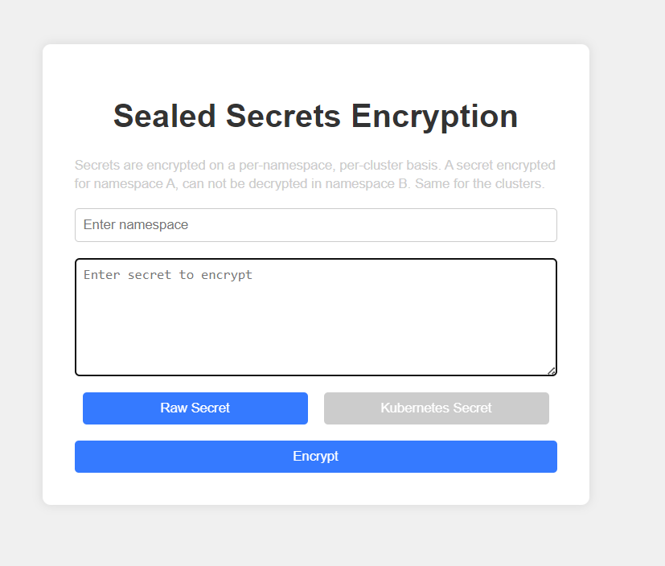

# Sealed Secrets Encryption

Secrets are encrypted on a per-namespace, per-cluster basis using Kubernetes `kubeseal`.

## Features

- Encrypt secrets for specific namespaces
- Supports both raw and Kubernetes secret encryption modes
- Copy encrypted secrets to clipboard
